# ☁️ CloudVault

A secure cloud storage web application that enables users to upload, organize, search, share, and manage files efficiently. CloudVault provides a modern interface with authentication, file versioning, analytics, folder management, and secure file sharing using Cloudinary and PostgreSQL.


---

# 📖 Overview

CloudVault is a full-stack cloud storage platform where users can securely upload, organize, search, share, and manage files and folders.

The application supports authentication, folder navigation, file versioning, analytics, favorites, recycle bin, activity tracking, and public file sharing through Cloudinary.

It provides an intuitive interface inspired by modern cloud storage platforms while ensuring secure access through JWT authentication.

---

# ❗ Problem Statement

Traditional file storage methods often suffer from:

- Poor organization of files
- Difficult file searching
- Limited sharing capabilities
- Risk of accidental deletion
- Lack of version control
- No centralized activity tracking
- Security concerns with unauthorized access

These issues make file management inefficient and reduce productivity.

---

# 💡 Solution

CloudVault addresses these challenges by providing a centralized cloud storage platform where users can:

- Securely upload files
- Organize files into folders
- Search files instantly
- Share files using public links
- Restore deleted files
- Manage favorite files
- Track recent activities
- Maintain multiple file versions
- View upload analytics

---

# ✨ Features

### 🔐 Authentication
- User Registration
- Secure Login
- JWT Authentication
- Password Hashing using bcrypt
- Email Verification
- Protected Routes

### 📁 File Management
- Upload Files
- Download Files
- Rename Files
- Delete Files
- Restore Deleted Files
- Permanent Delete
- Search Files
- Multiple File Upload
- File Metadata Management

### 📂 Folder Management
- Create Folder
- Rename Folder
- Delete Folder
- Nested Folder Support
- Folder Navigation

### ⭐ Favorites
- Star Files
- Remove from Favorites

### 🔗 File Sharing
- Generate Public Share Links
- Shared With Me
- Shared By Me
- Copy Share Link
- Revoke Shared Access

### 🗑️ Trash
- Soft Delete
- Restore Files
- Permanent Delete

### 📊 Dashboard
- Upload Analytics
- Weekly Upload Statistics
- Average Uploads
- Recent Activity

### 📜 Activity
- Recent Uploads
- Recently Modified
- Recently Accessed Files

### 📝 Version Management
- Upload New Versions
- View Version History
- Download Older Versions

### ☁️ Cloud Storage
- Cloudinary Integration
- Secure File URLs

### 🛡️ Security
- JWT Authentication
- Password Encryption (bcrypt)
- SQL Injection Protection using Parameterized Queries
- Input Validation using Express Validator
- Protected API Routes

---

# 🛠️ Tech Stack

## Frontend

- React
- Vite
- React Router
- React Bootstrap
- Axios
- React Hot Toast
- React Icons
- CSS3

## Backend

- Node.js
- Express.js
- PostgreSQL
- JWT
- bcrypt
- Express Validator
- Multer
- Cloudinary
- dotenv
- CORS

## Database

- PostgreSQL

## DevOps

- Docker
- Docker Compose
- Nginx

## Testing

- Jest

---

# 📂 Project Structure

```
CloudVault/

├── .github/
├── .vscode/
│
├── backend/
│   ├── src/
│   │   ├── config/
│   │   ├── controllers/
│   │   ├── database/
│   │   ├── middlewares/
│   │   ├── models/
│   │   ├── routes/
│   │   ├── services/
│   │   ├── utils/
│   │   ├── validators/
│   │   └── app.js
│   │
│   ├── tests/
│   ├── .env.example
│   ├── Dockerfile
│   ├── package.json
│   └── server.js
│
├── frontend/
│   ├── public/
│   ├── src/
│   │   ├── assets/
│   │   ├── components/
│   │   ├── context/
│   │   ├── hooks/
│   │   ├── layouts/
│   │   ├── pages/
│   │   ├── services/
│   │   ├── utils/
│   │   ├── App.jsx
│   │   ├── main.jsx
│   │   └── index.css
│   │
│   ├── .env.example
│   ├── Dockerfile
│   ├── nginx.conf
│   ├── package.json
│   └── vite.config.js
│
├── screenshots/
│   ├── login.png
│   ├── register.png
│   ├── dashboard.png
│   ├── dashboard2.png
│   ├── files.png
│   ├── folders.png
│   ├── shared-files.png
│   ├── shared-with-me.png
│   ├── shared-by-me.png
│   ├── recent.png
│   ├── starred.png
│   ├── trash.png
│   ├── activity.png
│   ├── preview.png
│   └── share-file.png
│
├── docker-compose.yml
├── README.md
└── .gitignore

```

---

# 📸 Screenshots

## 🔐 Login Page

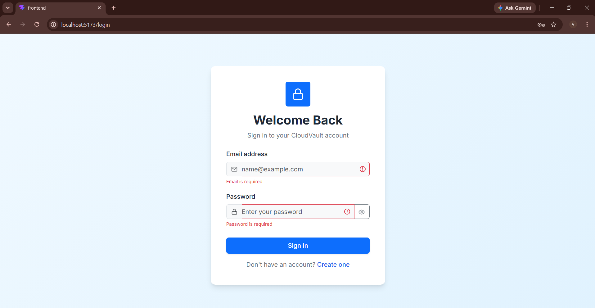

---

### 📝 Register Page

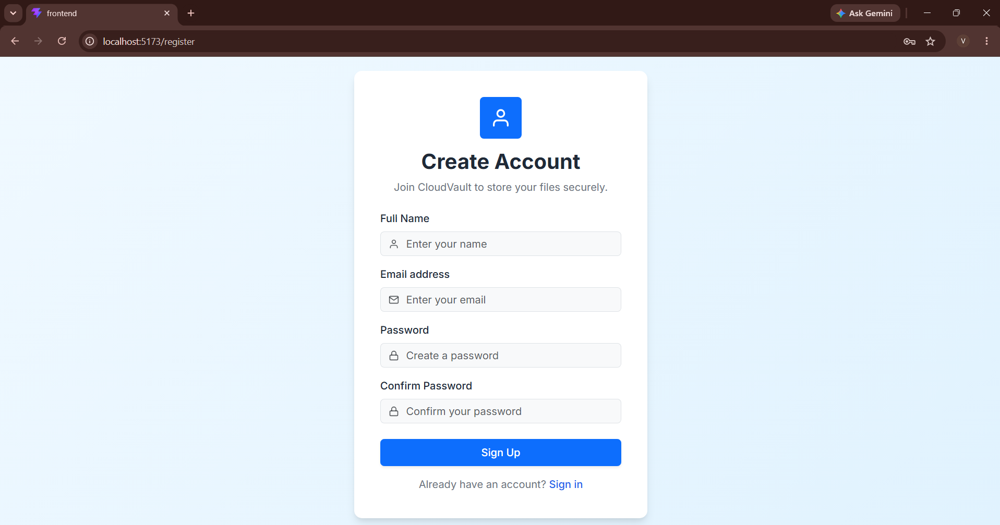

---

## 📊 Dashboard

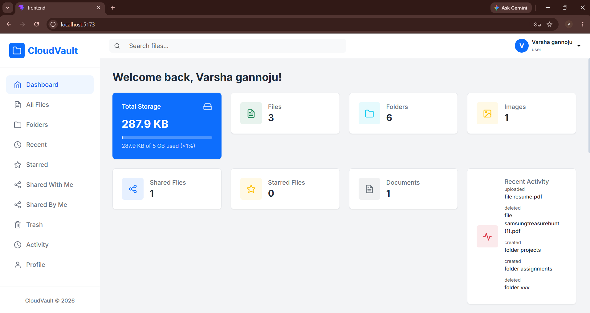

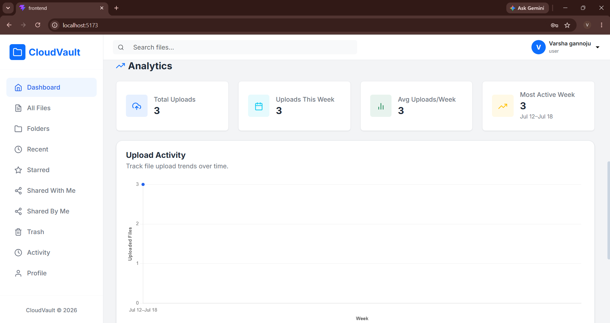

---

## 📂 Folder Management

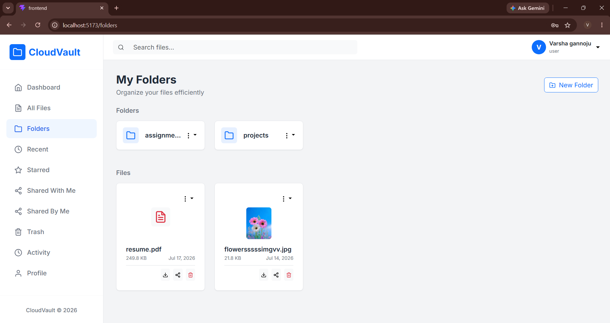

---

## 📄 All Files

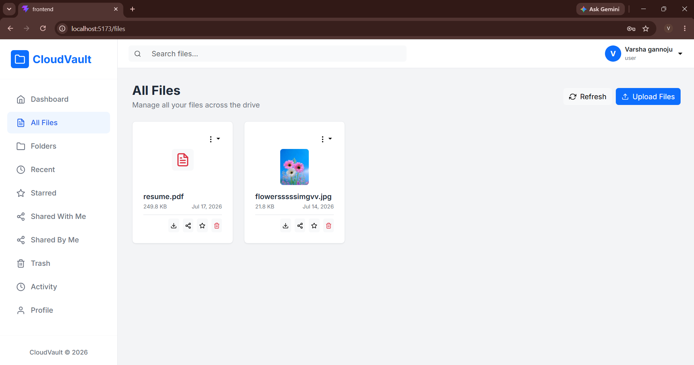

---

## ⭐ Favorites

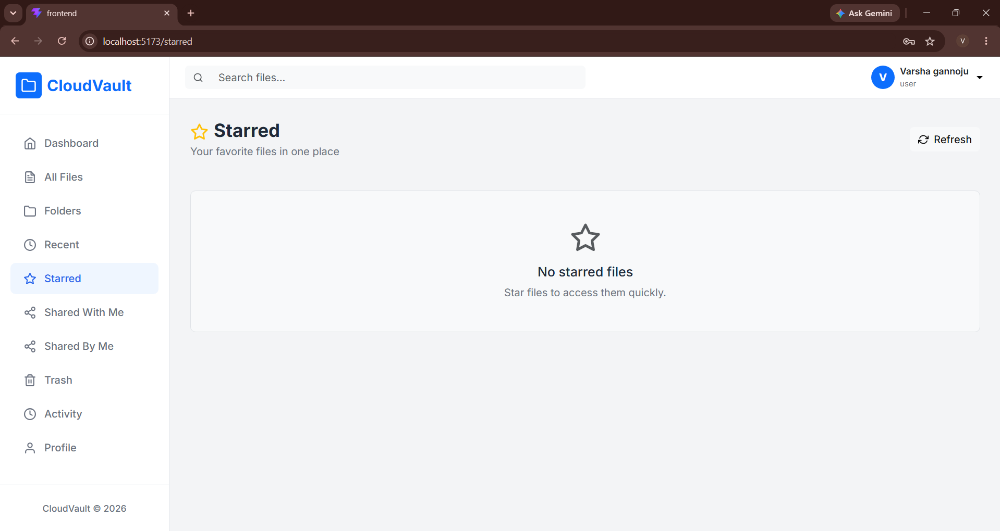

---

### 🤝 Shared With Me

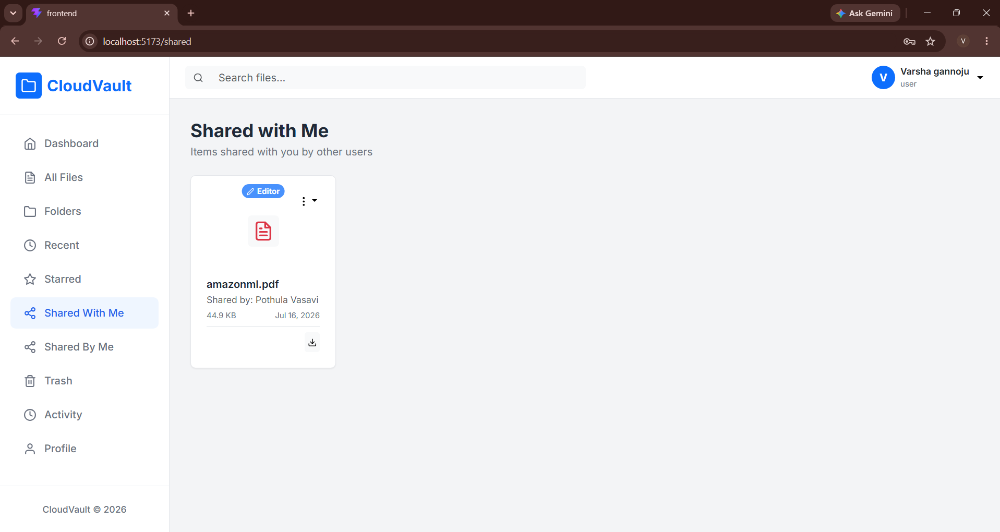

---

### 📤 Shared By Me

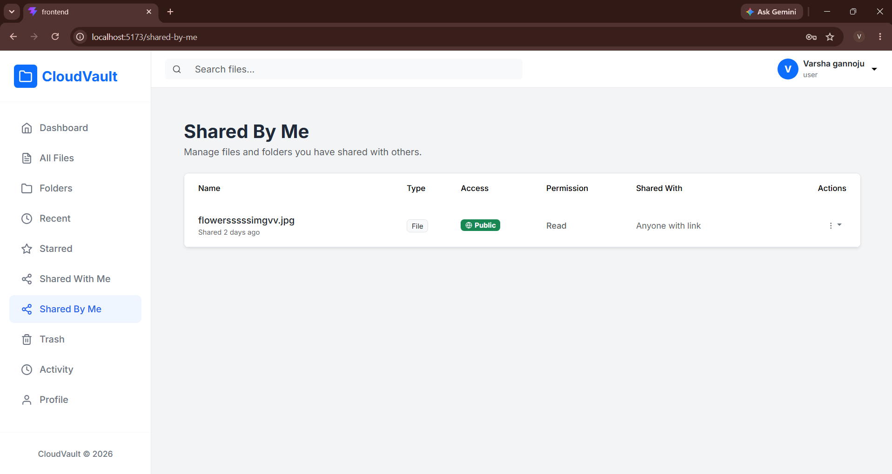

---

## 🔗 Share File

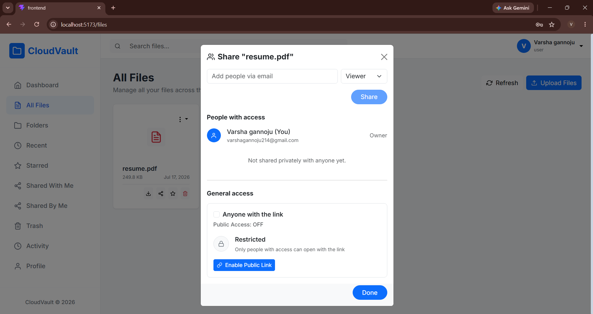

---

### 🕒 Recent Files

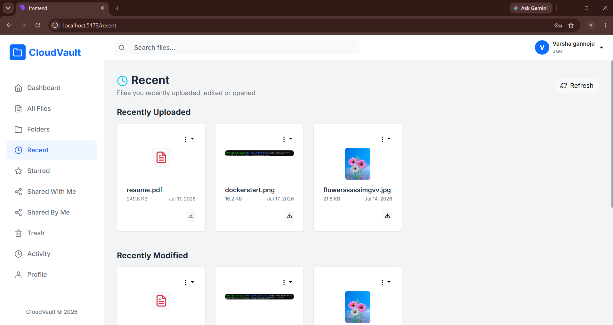

---

### 👁️ File Preview

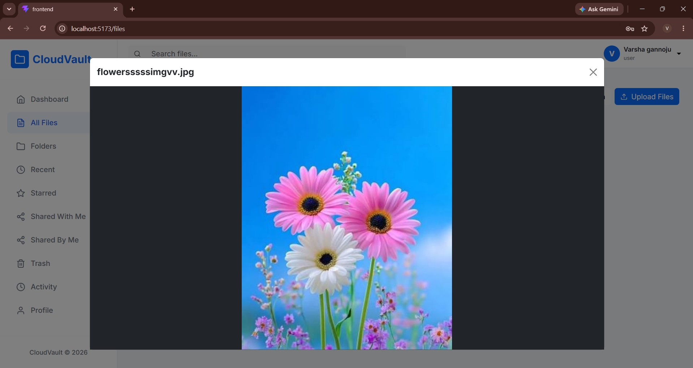

---

## 🗑️ Trash

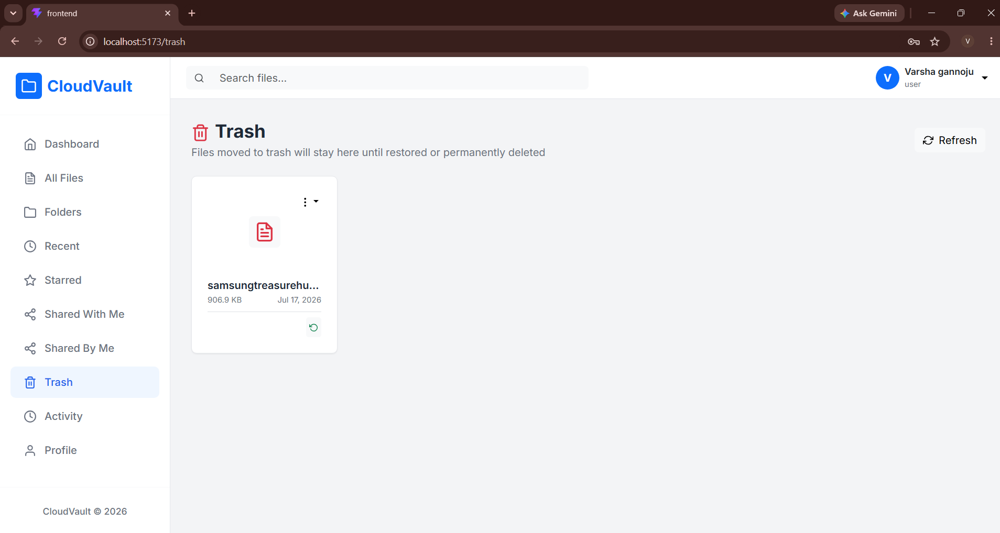

---

## 📈 Activity

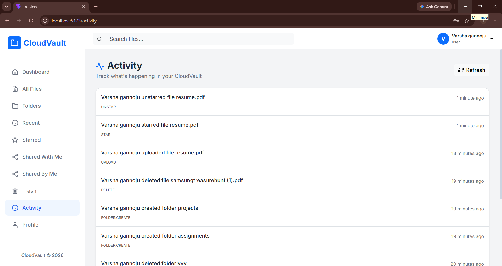

---

# ⚙️ Installation

## Clone Repository

```bash
git clone https://github.com/yourusername/cloudvault.git

cd cloudvault
```

---

# Backend Setup

```bash
cd backend

npm install

npm run dev
```

---

# Frontend Setup

```bash
cd frontend

npm install

npm run dev
```

---

# Environment Variables

## Backend (.env)

```env
PORT=5000

DATABASE_URL=your_postgresql_connection

JWT_SECRET=your_secret_key

JWT_EXPIRES_IN=7d

CLOUDINARY_CLOUD_NAME=your_cloud_name

CLOUDINARY_API_KEY=your_api_key

CLOUDINARY_API_SECRET=your_api_secret
```

---

# Run Application

Backend

```
http://localhost:5000
```

Frontend

```
http://localhost:5173
```

---

# 🔐 Authentication Flow

1. User registers.
2. Email verification is completed.
3. Password is hashed using bcrypt.
4. JWT token is generated.
5. Protected APIs validate JWT.
6. Users access only their own files and folders.

---

# 🛡️ Security Features

- JWT Authentication
- Password Hashing using bcrypt
- SQL Injection Protection using Parameterized Queries
- Express Validator Input Validation
- Secure Cloudinary File Storage
- Protected API Routes
- Authorization Middleware

---

# 🚀 Future Enhancements

- Forgot Password
- Two-Factor Authentication (2FA)
- File Compression
- Folder Sharing
- Dark Mode
- Mobile Application
- AI File Tagging

---

# 📚 Learning Outcomes

This project strengthened my understanding of:

- Full Stack Web Development
- React Application Development
- Express.js REST APIs
- PostgreSQL Database Design
- JWT Authentication
- Secure Password Hashing
- Cloudinary Integration
- Docker Containerization
- File Upload Management
- File Versioning
- Database Relationships
- Search & Pagination
- REST API Design
- Secure Backend Development

---

# 🤝 Contributing

Contributions are welcome.

1. Fork the repository.
2. Create a feature branch.

```bash
git checkout -b feature-name
```

3. Commit your changes.

```bash
git commit -m "Add new feature"
```

4. Push the branch.

```bash
git push origin feature-name
```

5. Open a Pull Request.

---

# 👩‍💻 Author

**Varsha Gannoju**

GitHub: https://github.com/VarshaGannoju

LinkedIn: https://www.linkedin.com/in/varsha-gannoju-481780362/

---

# ⭐ Support

If you found this project helpful, please consider giving it a ⭐ on GitHub.

Made with using React, Node.js, Express.js, PostgreSQL, and Cloudinary.